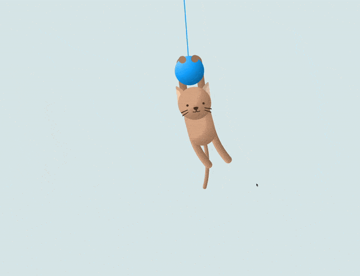

## Readme

# 🐱 Swinging Cat Animation

This project features an animated swinging cat, showcasing intricate CSS animations and transitions.

## 📦 Technologies

Built with:

- `HTML:` Markup language for creating the structure.
- `CSS:` For styling and animations.

## ⚙️ Getting Started

To view and interact with the swinging cat animation:

1. Download the project files.
2. Open the `index.html` file in Visual Studio Code.
3. Use the Live Server extension in VS Code to view the project in your web browser.

## 🖱️ Interaction

Open the project in your browser to see the cat swing back and forth with smooth animations.

## 🛣️ Project Structure

Here are the key files and their purposes:

- **index.html**: The main HTML file containing the structure of the swinging cat animation.
- **style.css**: The CSS file that styles the cat and adds animations.

Feel free to explore and customize these files to suit your needs!

## 📱 Responsive Design

- The swinging cat animation is responsive, ensuring a seamless experience on both desktops and mobile devices.

## 🔄 Animations

The cat animation includes various CSS animations that create a swinging effect. Here’s an overview:

- **Swinging Motion**: The entire cat structure swings back and forth.
- **Legs and Tail Movement**: Legs and tail move in a complementary swinging motion.
- **Blinking Eyes**: The cat's eyes blink periodically.
- **Bobbing Yarn**: The yarn also moves slightly to add realism.
